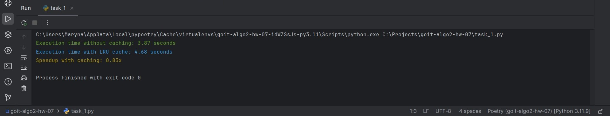
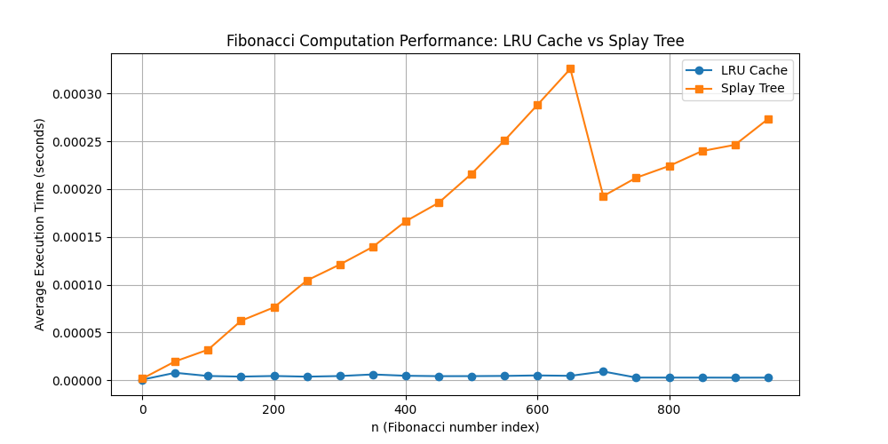
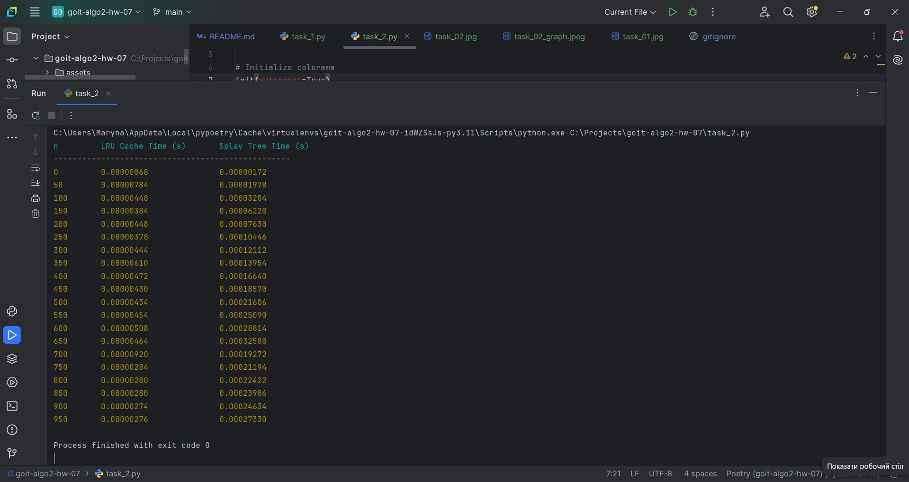

# HW-7 | Cache Management Algorithms

## Welcome 🌞

Ready to apply cache management algorithms? Then let's get to work!

By completing the first task, you will learn to use an LRU cache to optimize 
data processing in a program. This task will help you practically compare the 
performance of a program with and without caching, assessing how caching can 
significantly reduce query execution time in systems with large data volumes.

In the second task, you will implement different methods for optimizing Fibonacci
number calculations: using the `@lru_cache` decorator and using a Splay Tree
data structure. This will allow you to compare two different algorithms, 
evaluate their efficiency, and visually compare the results.

These tasks will help you understand the advantages and limitations of 
different caching approaches and their impact on program performance, 
especially for large input data.

Good luck! 😎

---

## Task 1. Optimizing Data Access Using LRU Cache

### Implement a program to optimize query processing on an array of numbers using an LRU cache.

### Technical Requirements

1. Given an array of size **N** consisting of positive integers (**1 ≤ N ≤ 100,000**), process **Q** queries (**1 ≤ Q ≤ 50,000**) of the following types:

   - **Range(L, R)** – find the sum of elements in the segment from index **L** to **R**, inclusive.
   - **Update(index, value)** – replace the value of an element at index **index** with a new **value**.

2. Implement four functions for working with the array:

   - `range_sum_no_cache(array, L, R)`  
     Computes the sum of elements in the segment from **L** to **R** inclusively, without using caching. The result is recomputed for each query.

   - `update_no_cache(array, index, value)`  
     Updates the value of an array element at the specified index without using caching.

   - `range_sum_with_cache(array, L, R)`  
     Computes the sum of elements in the segment from **L** to **R**, using an LRU cache. If the sum for this segment was previously calculated, it is retrieved from the cache; otherwise, it is computed and added to the cache.

   - `update_with_cache(array, index, value)`  
     Updates the value of an array element at the specified index and removes all related cache entries that become invalid due to the modification.

3. For testing, create an array of **100,000** elements filled with random numbers and generate **50,000** queries of type **Range** and **Update** in random order.

   **Example query list:**  
   `[('Range', 46943, 91428), ('Range', 5528, 29889), ('Update', 77043, 78), ...]`

4. Use an LRU cache of size **K = 1000** to store precomputed results for **Range** queries. The cache should automatically remove the least recently used entries when reaching its maximum size.

5. Compare the query execution time:

   - Without caching.
   - With LRU caching.
   - Output the execution time for both approaches.

### Acceptance Criteria

📌 **These criteria must be met for the homework to be considered. If any criterion is not met, the mentor will return the assignment for revision without grading.**  
If you need clarification 😉 or are stuck at any stage, contact your mentor in Slack.

1. All functions (`range_sum_no_cache`, `update_no_cache`, `range_sum_with_cache`, `update_with_cache`) are implemented and working.
2. The program measures query execution time with and without caching and displays the results in a clear format.
3. Test results are presented in an understandable format to evaluate the efficiency of LRU caching.
4. The code executes without errors and meets the technical requirements.

### Example Console Output
```python
f"Execution time without caching: 3.11 seconds"
f"Execution time with LRU caching: 0.02 seconds"
```
---


---

## Task 2. Performance Comparison of Fibonacci Computation Using LRU Cache and Splay Tree

### Implement a program to compute Fibonacci numbers using two methods:  
1) **With LRU cache**  
2) **With a Splay Tree** for storing previously computed values.  

Compare their efficiency by measuring the average execution time for each approach.

### Technical Requirements

1. Implement two functions for computing Fibonacci numbers:

   - `fibonacci_lru(n)`  
     Uses the `@lru_cache` decorator to cache computation results, allowing reuse of previously computed Fibonacci numbers.

   - `fibonacci_splay(n, tree)`  
     Uses a **Splay Tree** to store computed values. If the Fibonacci number for **n** is already computed, it is retrieved from the tree; otherwise, it is computed, stored in the Splay Tree, and returned.

2. Measure the execution time of Fibonacci computation for each approach:

   - Generate Fibonacci numbers for values from **0 to 950** with a step of **50**:  
     `0, 50, 100, 150, ...`
   - Use the `timeit` module to measure execution time.
   - For each **n**, compute the average execution time using **LRU Cache** and **Splay Tree**.

3. Plot a graph comparing execution time for the two approaches:

   - Use **matplotlib** to create the graph.
   - **X-axis**: Fibonacci number index (**n**).
   - **Y-axis**: Average execution time in seconds.
   - Add a **legend** indicating the two methods: **LRU Cache** and **Splay Tree**.

4. Draw conclusions on the efficiency of both approaches based on the graph.

5. In addition to the graph, display a **formatted table** with values of **n**, average execution times for **LRU Cache** and **Splay Tree**.

### Acceptance Criteria

1. **`fibonacci_lru` and `fibonacci_splay` functions** are implemented and compute Fibonacci numbers using caching.
2. Execution time is measured for each approach at each **n**, and a **graph** is generated to display the results.
3. The graph includes **axis labels, a title, and a legend** explaining which method was used.
4. A **formatted table** with results is displayed in the terminal.
5. The results are analyzed based on the graph, showing which approach is more efficient for computing Fibonacci numbers at large values of **n**.
6. The code executes correctly and meets the technical requirements.

### Example Table Output

| n   | LRU Cache Time (s) | Splay Tree Time (s) |
|-----|--------------------|---------------------|
| 0   | 0.00000028        | 0.00000020         |
| 50  | 0.00000217        | 0.00000572         |
| 100 | 0.00000164        | 0.00000532         |
| 150 | 0.00000174        | 0.00000526         |

# RESULTS

**Task 1**


**Task 2**

